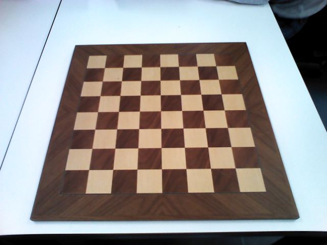

# TIAGo instructions

## Preliminary operations

1. Boot TIAGo and establish WiFi connection (i.e. connect to the tiago-108c network for the robot at WE-COBOT).
2. Place the chessboard on the table **without** the pieces, the clock, nor the box.
3. Using the joystick, move TIAGo in front of the chessboard. Raise the torso to the maximum height. Lower the head as much as possible.
   Open the WebCommander (i.e. http://tiago-108c:8080 for the robot at WE-COBOT) to check TIAGo's view. The below image is demonstrational of what the robot should see (i.e. complete view of the chessboard, almost aligned with the images axis).

   > **Tip.** In this phase, it is useful to place the clock and the box aside the chessboard to check that they will be included in the robot field of view.

   <p align="center">
   
   </p>

4. From the WebCommander, put TIAGo in _gravity compensation_ (from the _Robot demos_ tab) and manually raise the robot's arm. Place it so that the end-effector is above the table and on the right side of the chessboard (w.r.t. the robot point of view) so that the arm does not occludes the line-of-sight.

## Before launch

1. Browse to the `scripts` folder, delete the `live_chessboard_situation.yaml` file.
2. Duplicate the `live_chessboard_situation_INIT.yaml` file and rename it to `live_chessboard_situation_INIT.yaml`.
   The steps **1** and **2** are needed to remove any possible saved game configuration.
3. Open the `play_chess.py` script and make sure that the `ready` flag (line 33) is set to `False`. This flag should be set to `True` to start a game relying on a previous initial setup.
4. Connect the Arduino to the USB right port (in the WE-COBOT desktop PC).
5. Connect the joystick to the USB left port (in the WE-COBOT desktop PC).

## To launch

Open a terminal, connect it to the robot and type:

```
roslaunch tiago_playchess tiago_chess.launch
```

## To launch without repeating the setup operations

1. Open the `play_chess.py` script and make sure that the `ready` flag (line 33) is set to `True`
2. Open a terminal, connect it to the robot and type:

```
roslaunch tiago_playchess tiago_chess_pronto.py
```

> **Note.** This option is meant to go on with a game if something goes wrong and the application has to be shutdown. **Do not** use it if the robot has been moved in the meantime.

# Additional information (TO TRANSLATE)

- Quando si apre la finestra di istruzioni sulla scacchiera, non chiuderla con il pulsante close perché dava un errore. Quando ho tempo conto di sistemarlo. Per ora chiudila con la x in alto a destra oppure spostala in modo che non dia fastidio.
- Il “manual mode” della scacchiera ad oggi funziona solo col mouse, non col joystick.
  Indicazioni per manual mode: consiglio, se si volesse “spostare” un pezzo presente sulla GUI da una casella all’altra, di eliminarlo pèrima con “Empty square” e poiu di aggiungerlo subito dopo, senza eliminare prima altri pezzi. Es: voglio spostare un cavallo che ora è in g1 in f3: “Empty square” → Clicco su cavallo in g1 → “Icona cavallo” → Clicco su f3.
  Quando poi clicco su “Back to game”, il process torna allo stato per cui bisoghna dare una mossa a TIAGo da eseguire (lui sta aspettando di muovere, non sta aspettando che l’avversario faccia una mossa).
- Se volessi pilotare il “working state” in cui si trova TIAGo, puoi pubblicare nel topic /state lo stato desiderato.
  Es di stati importanti in cui si potrebbe volere andrae “forzatamente”:

1. `/state 11`: stato in cui TIAGo aspetta che tu gli dia una mossa da eseguire dalla GUI.
2. `/state 14`: stat in cui TIAGo aspetta che l’avversario schiacci il pushbutton sul clock per cominciare a analizzare le pointcloud per capire la mossa dell’avversario.
3. `/state 15`: stato in cui comincia l’analisi della pointcloud per capire la mossa dell’avversario.
   Per forzare lo stato, nel terminal:

```
rostopic pub /state std_msgs/Int16 ‘numero dello stato desiderato’
```
